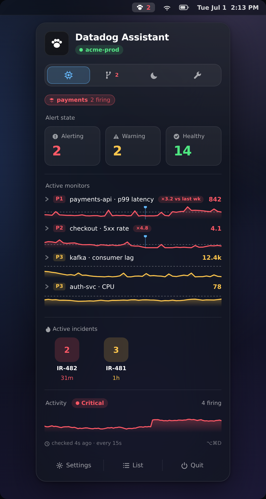

# 🐶 Datadog Assistant — native macOS menu bar app

[](LICENSE)


[](https://github.com/mxnyawi/datadog-assistant/actions/workflows/ci.yml)
[](CONTRIBUTING.md)

Your Datadog monitors, incidents, and deploys — one click away in the menu
bar, with alerts that are **impossible to ignore**. Native SwiftUI, no Electron,
no agent, no permissions: just HTTPS to Datadog's API.

> ⚠️ Unofficial personal tool — not affiliated with or endorsed by Datadog,
> Inc. You bring your own API keys.



## 🚀 Install (two minutes)

**Option A — download the app**

1. Grab **`Datadog-Assistant.dmg`** from the
   [latest release](https://github.com/mxnyawi/datadog-assistant/releases/latest),
   open it, and drag the app to Applications.
2. First open only: the app isn't notarized yet, so **right-click the app →
   Open → Open** (or System Settings → Privacy & Security → *Open Anyway* on
   macOS 15+).
3. A 🐾 appears in the menu bar and a welcome window walks you through
   connecting — done.

**Option B — Homebrew**

```bash
brew tap mxnyawi/datadog-assistant https://github.com/mxnyawi/datadog-assistant
brew install --cask --no-quarantine datadog-assistant
```

(`--no-quarantine` skips Gatekeeper's "can't be checked for malicious
software" block — the app is ad-hoc signed, not notarized yet. Omit it if you
prefer the right-click → Open ritual.)

**Option C — build from source** (Xcode CLT + Swift 5.9)

```bash
git clone https://github.com/mxnyawi/datadog-assistant
cd datadog-assistant/swift && ./Scripts/build-app.sh
open "build/Datadog Assistant.app"
```

## 🔐 Connecting to Datadog

With nothing configured, the panel shows a **Connect to Datadog** prompt right
in the app — no separate setup window. Three ways in:

1. **Access token (primary).** A Datadog **access token** — `ddpat_…`
   (personal, Datadog's recommended credential for tools like this since
   mid-2026) or `ddsat_…` (service-account, can be non-expiring) — is one
   scoped credential that replaces the API + app key pair. Create it under
   *Personal Settings → Access Tokens*; the setup UI lists the exact scopes
   with a copy button: `monitors_read, monitors_downtime, events_read,
   incident_read, dashboards_read, timeseries_query`. Paste it into the connect
   prompt; it's validated before saving. (Personal tokens expire — max 1 year;
   the app shows 401/403 when it lapses, paste a fresh one. Want set-and-forget?
   Use a service-account `ddsat_` token.)

2. **API + Application keys.** The classic pair still works — same tab in the
   connect prompt and in Settings.

3. **Team LastPass vault.** Point the app at a shared LastPass secure note and
   the whole team runs off one credential, rotation in one place. Settings →
   *Team LastPass* → **Set up…** installs the `lpass` CLI (via Homebrew), signs
   you in (MFA supported), and validates the entry — no terminal. The note
   holds `datadogAPIKey` / `datadogAPPKey` (or a single access-token field via
   `DD_LASTPASS_TOKEN_FIELD`); optional `githubToken` powers deploy
   correlation, `jiraToken` powers one-tap Jira tickets.

**Secrets never touch the macOS login Keychain** (which prompts unsigned apps
for your password on every access). They're AES-GCM encrypted on the device,
Secure-Enclave-wrapped where possible — details in
[swift/README.md](swift/README.md).

Every Datadog site works (US1/EU/US3/US5/AP1/Gov). Power users can override
everything with env vars (`DD_BEARER_TOKEN`, `DD_API_KEY`, `DD_APP_KEY`,
`DD_SITE`, `DD_LASTPASS_ENTRY`, …) or a password-manager command
(`op read …`, `lpass show …`) — see [swift/README.md](swift/README.md).

## ✨ What it does

| | |
|---|---|
| 🚨 | Menu bar count appears the second a monitor alerts; the panel opens on **⌥⌘D** from anywhere |
| 🦸 | **Hero card** for the worst firing P1/P2: live value vs threshold, sparkline with deploy markers, the suspect change, mute/open actions |
| 🔴🟡🟢 | Tap-to-drill summary tiles + every monitor grouped by state, worst first, with search |
| 📈 | Sparkline, firing duration, triggered hosts, and threshold on every expanded row |
| 🔀 | **Changes tab** — merged PRs, deploy events, and CI runs, with "landed 12m before this alert" suspects called out |
| 💀 | **Dead-letter-queue grouping** — DLQ monitors auto-detected and consolidated; firing ones stay in your face, healthy ones collapse |
| 🤫 | **No Data triage** — *likely broken* vs *expected quiet*, only the broken ones notify |
| 🔇 | Mute 1h/4h/24h/forever, unmute, snooze everything for the afternoon |
| 🪧 | Native notifications with per-priority rules (P1 → modal + nag, P3 → banner), recovery alerts, daily digest |
| 🎫 | One-tap Jira ticket per alert (or auto-create for P1s) |
| ✏️ | Local rename — relabel unwieldy monitor names just for yourself |
| 🔗 | Quick links to Dashboards / Monitors / Logs / APM / Incidents + your own dashboards |

The panel follows the macOS design language — system materials, light & dark
mode, the menu-bar-panel layout conventions used by the system status menus —
so it feels like part of the OS, not a web page in a window.

## 🛠 Development

The native app lives in [`swift/`](swift/) (SwiftPM, no Xcode project needed):

```bash
cd swift
swift build            # compile
./Scripts/build-app.sh # assemble the .app bundle (ad-hoc signed)
DD_DEMO=1 swift run    # dev loop on generated demo data
```

CI compiles the package on macOS and runs the checks on every PR. Tagging
`v*` (or dispatching the Release workflow) builds the app on a macOS runner
and publishes the DMG/zip with checksums.

- [swift/README.md](swift/README.md) — architecture, credential precedence, feature docs
- [swift/PARITY.md](swift/PARITY.md) — feature-parity audit vs the original Python app
- [CONTRIBUTING.md](CONTRIBUTING.md) · [SECURITY.md](SECURITY.md) · [CODE_OF_CONDUCT.md](CODE_OF_CONDUCT.md)

### Legacy Python app

This project started as a Python/rumps menu bar app; it still works and ships
from the same repo (`datadog_assistant.py`, `install.sh`). Docs:
[docs/legacy-python-app.md](docs/legacy-python-app.md). New features land in
the Swift app.

## 📄 License

MIT — see [LICENSE](LICENSE).
