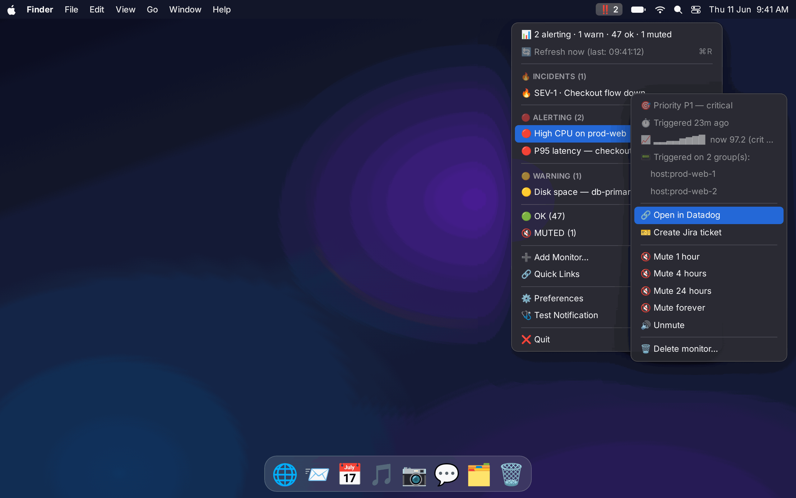
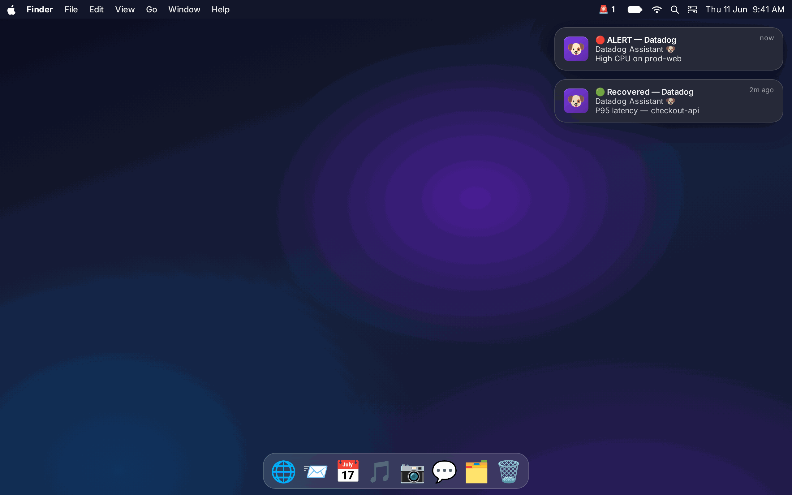
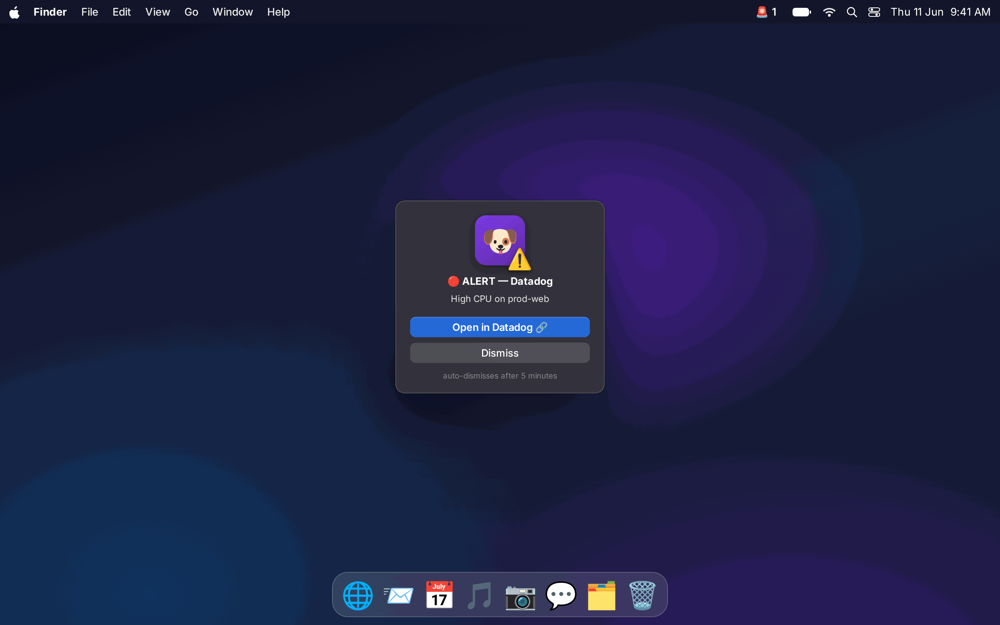
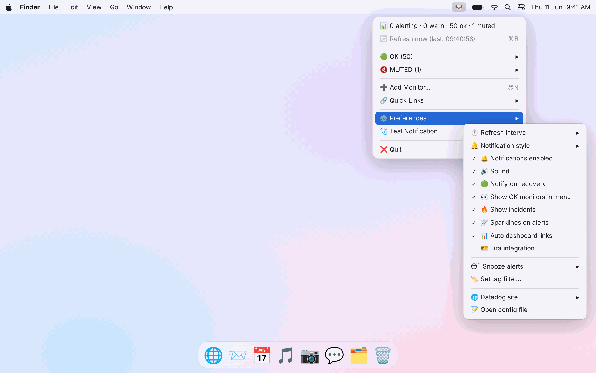

# 🐶 Datadog Assistant — macOS menu bar app

[](LICENSE)


[](CONTRIBUTING.md)

Your personal Datadog sidekick that lives in the menu bar and makes alerts
**impossible to ignore** — because emails and Teams messages get lost.

> ⚠️ Unofficial personal tool — not affiliated with or endorsed by Datadog,
> Inc. or Atlassian. You bring your own API keys.

## 📸 See it in action

**Every monitor grouped by state, one click from acting on it.** The menu bar
icon flips from 🐶 to **‼️ 2** the moment something fires — open the menu and
each alerting monitor carries its priority, how long it's been firing, a live
sparkline and the triggered hosts, with mute / Jira / open-in-Datadog right
there.



**Alerts you can't miss.** A native banner with sound for every alert and
recovery — or a modal popup that stays on screen until you act, for the P1s
that can't be ignored like an email.

| Native banners + recovery | Critical modal popup |
|:---:|:---:|
|  |  |

**Tune every behaviour from the menu** — notification style, sound, recovery
alerts, sparklines, incidents, Jira, snooze and more, no config editing needed.



> Screenshots are rendered mockups of the real UI (`docs/mockup.html` →
> `python3 docs/shoot.py`), not live captures.

## ✨ What it does

| | |
|---|---|
| 🚨 | Menu bar icon flips from 🐶 to **🚨 2** the second a monitor alerts |
| 🛑 | Optional **modal popup** (critical alert you must dismiss) + 🪧 banner + 🔊 sound |
| 🔴🟡🟢 | All monitors grouped by state — Alert / Warn / No Data / OK / Muted |
| 💀 | **Dead-letter-queue grouping** — auto-detects DLQ monitors (by name, query, or tag) and consolidates them into one severity-sorted 💀 section so the queues you babysit live in one place. Firing ones stay inline; healthy ones tuck into a 🟢 submenu |
| ✏️ | **Local rename** — relabel any monitor to something you recognise (`💳 Payments CPU`). The label is yours only — Datadog is never touched — and it follows the monitor into menus, notifications, and DLQ detection. ↩️ reset anytime |
| 🤫 | **No Data triage** — splits No Data into *likely broken* (metric was flowing then stopped, monitor wants no-data alerts) vs *expected quiet* (no-data notifications off, event-stream monitors, stale/retired, metric silent for 24h+). Only broken ones notify; quiet ones collapse into a 🤫 submenu with the reason |
| 🔇 | Mute any monitor for 1h / 4h / 24h / forever, unmute, 🗑 delete (type-DELETE confirm) |
| ➕ | Create new metric monitors from the menu bar |
| 🔗 | Quick links: Dashboards, Monitors, Logs, APM, Incidents + your own custom links |
| 😴 | Snooze all alerting for 30m / 1h / 4h / rest of day |
| 🏷 | Tag + name filters so you only see *your* team's monitors |
| 🔁 | Re-notifies every N minutes while a monitor is **still** alerting |
| 🟢 | Recovery notifications when things go back to OK |
| 🔐 | **API keys, OAuth, or LastPass CLI** — pick at setup; keys via macOS Keychain / config / env, OAuth browser login, or shared LastPass vault entry fetched at runtime |
| 🌐 | Works with every Datadog site (US1/EU/US3/US5/AP1/Gov) |
| 🎯 | **Severity engine** — per-priority (P1–P5) notification rules: P1 gets modal + 10-min nag, P3 just a banner |
| 📈 | **Live context on every alert**: sparkline of the metric, current value vs critical threshold |
| ⏱ | How long it's been alerting + 📟 which hosts/groups triggered |
| 🔥 | Active Datadog **incidents** (SEV-1…5) right in the menu |
| 📊 | Your real dashboards auto-populated into Quick Links |
| 🌅 | Optional daily digest notification (`digest_hour`) |
| 🎫 | **Jira integration** — create tickets per alert from the menu, or auto-create for P1/P2, with open-ticket dedupe |
| 🧭 | **Service context (repos & deploys, from Datadog)** — surfaces the repo, runbook, docs, dashboard and on-call links Datadog already holds for a firing monitor (Software Catalog + the monitor's own tags + links in its message), plus recent **deploy events** — flagging any that shipped *just before* the alert (`🚀 Deploy "…" 12m before this alert`). No GitHub credentials needed |

## 🚀 Install (on your Mac)

### Easiest , download the app (no Terminal) ⭐

1. **[Download the latest installer](https://github.com/mxnyawi/datadog-assistant/releases/latest/download/Datadog-Assistant-Installer.zip)**
   (or from the [website](https://datadog-assistant.pages.dev)).
2. Open the downloaded zip , it unzips to **Datadog Assistant Installer**.
3. **Right-click → Open** the first time (it's unsigned; if macOS still blocks
   it, go to **System Settings → Privacy & Security → Open Anyway**).
4. Follow the steps: pick your site, sign in, done. The 🐶 appears in your menu bar.

The installer is a native macOS app, built from [`installer/`](installer/) and
published to Releases via `installer/release.sh` (run on a Mac). You can also run
it without building anything: `osascript installer/install.applescript`.

### Or the script:

```bash
cd datadog-assistant
chmod +x install.sh
./install.sh
```

The installer:
1. creates a venv at `~/.datadog-assistant` and installs `rumps`
2. lets you authenticate with **API + App keys** (stored in the macOS
   Keychain 🔐), **OAuth** (browser login), or **LastPass CLI** (shared vault)
3. installs a LaunchAgent so the app starts at login and stays alive

Then look for **🐶** in your menu bar. Use **🩺 Test Notification** to verify
banners/popups work (grant notification permission if macOS asks), and
**🔐 Test Datadog connection** to confirm your credentials work.

### Run manually instead

```bash
pip3 install rumps
DD_API_KEY=xxx DD_APP_KEY=yyy python3 datadog_assistant.py
```

## 🔑 Authentication — API keys or OAuth

Pick either at setup (installer, or **Preferences → 🔐 Datadog credentials…**).
Switch any time; secrets live in the macOS Keychain, never the config file.

### Option A — API + App keys (quickest)

Get them at **Organization Settings → API Keys / Application Keys**. The
**application key** needs the `monitors_read`, `monitors_write` and
`monitors_downtime` scopes (add `dashboards_read` / `incident_read` for the
dashboard and incident sections). That's it.

### Option B — OAuth (browser login, no keys on disk)

Log in once in the browser; the app keeps a **rotating refresh token** in the
Keychain and calls the API with short-lived Bearer tokens — your keys never
touch the machine, and your **region is auto-detected** from the login. Good
for orgs that prefer SSO/consent over provisioning keys.

One-time prerequisite — create an **OAuth client** in Datadog (Organization
Settings → OAuth, or the Developer Platform):

1. **Scopes**: `monitors_read`, `monitors_write`, `monitors_downtime`,
   `dashboards_read`, `incident_read`, `metrics_read`, `events_read`
2. **Redirect URI**, exactly: `http://localhost:8918/callback`
3. Copy the **Client ID** and **Client Secret**.

Then **Preferences → 🔐 Datadog credentials… → OAuth**, paste the Client ID and
Secret, and approve the login in your browser. The app authenticates against
`app.<site>/oauth2/v1/authorize` + `api.<site>/oauth2/v1/token` (PKCE, S256) and
stores only the refresh token + secret in Keychain service
`datadog-assistant-oauth`.

> Notes: the redirect URI must match `http://localhost:8918/callback` exactly.
> Datadog access tokens last ~1h and are refreshed automatically; if a refresh
> ever fails the menu bar shows 🔌 with a "reconnect via Preferences" hint.

### Option C — LastPass CLI (shared vault, no keys on disk)

Best for teams: a single set of API keys lives in a **shared LastPass folder**
as a Secure Note, and the tool fetches them at runtime via the `lpass` CLI. No
keys stored on any workstation. Access is controlled by LastPass folder membership.

**Secure Note layout** (key=value lines in the Notes body):

```
jiraClientID=your-jira-oauth-client-id
jiraClientSecret=your-jira-oauth-client-secret
datadogAPIKey=your-datadog-api-key
datadogAPPKey=your-datadog-app-key
```

**Setup:**

1. Create a shared folder in LastPass (e.g. `Shared-SRE/datadog-assistant`)
2. Add a Secure Note with the key=value layout above
3. Run `./install.sh` and choose option **3) LastPass CLI** — it will:
   - Install `lpass` via Homebrew if missing
   - Prompt for the entry path and field names
   - Write the config

Or configure manually in `~/.config/datadog-assistant/config.json`:

```json
{
  "auth": "lastpass",
  "lastpass": {
    "entry": "Shared-SRE/datadog-assistant",
    "api_key_field": "datadogAPIKey",
    "app_key_field": "datadogAPPKey",
    "jira_client_id_field": "jiraClientID",
    "jira_client_secret_field": "jiraClientSecret"
  }
}
```

**Requirements:** `lpass` CLI installed (`brew install lastpass-cli`) and an
active session (`lpass login your@email.com`). The tool checks login status
on each launch and shows 🔌 if the session has expired.

**Why this is good for SRE teams:**
- Rotate keys in one place — all users get the new key automatically
- Revoke access by removing someone from the LastPass shared folder
- Audit trail (LastPass Enterprise) of who accessed the entry and when
- No `.env` files to accidentally commit

## ⚙️ Customization — `~/.config/datadog-assistant/config.json`

Everything is configurable (see `config.example.json` for a full example):

- **`icons`** — change every menu bar emoji (🐶/🚨/⚠️/🤷/😴/🔌) and toggle the alert count
- **`notifications.style`** — `"banner"`, `"modal"` (the unmissable popup), or `"both"`
- **`notifications.sound_name`** — any macOS sound: `Sosumi`, `Glass`, `Hero`, `Submarine`, `Funk`…
- **`notifications.renotify_minutes`** — nag interval while still alerting (0 = off)
- **`tag_filter`** / **`name_filter`** — scope to your team, e.g. `"team:payments env:prod"`
- **`browser`** — open links in a specific browser, e.g. `"Google Chrome"`,
  `"Firefox"`, `"Arc"`. Empty = system default. Set this if every link asks
  you to log in: links were opening in the default browser (often Safari)
  instead of the one holding your Datadog session.
- **`app_subdomain`** — orgs with a custom subdomain (you normally browse
  `yourorg.datadoghq.eu`) should set `"yourorg"`, otherwise deep links to
  `app.<site>` bounce you to the login page.
- **`quick_links`** — Datadog pages (relative paths, follow your `site`)
- **`custom_links`** — any URL: dashboards, runbooks, wikis
- **`menu.group_order`**, **`menu.show_ok_monitors`**, **`menu.max_per_group`**
- **`refresh_seconds`** — poll interval (min 15s; mind your API rate limits)

New in v0.2:

- **`severity.rules`** — per-priority behavior. Priority is read from the
  monitor's priority field, a `priority:p1` tag, or `[P1]` in the name.
  Each rule can set `style`, `renotify_minutes`, `icon` (menu bar), `sound_name`.
- **`context`** — toggles for sparklines 📈, triggered groups 📟,
  incidents 🔥, and auto dashboard links 📊.
- **`digest_hour`** — e.g. `9` for a morning summary banner; `null` to disable.
- **`jira`** — see below.
- **`no_data_triage`** — smart No Data classification. A monitor in No Data is
  *quiet* (🤫 collapsed submenu, no notification) when: its author turned
  no-data notifications off / set it to resolve on missing data; it watches an
  event stream (log/event/RUM/CI monitors — zero events is usually healthy);
  it's been silent longer than `stale_hours` (default 48 — retired host,
  seasonal job); or a live probe finds zero datapoints across the last
  `probe_lookback_hours` (default 24). It's *likely broken* (top-level ⚪
  group + notification, with the reason attached) when the monitor wants
  no-data alerts — especially when the probe shows the metric **was flowing
  and then stopped** (dead agent/host). Probes are capped at `max_probes`
  metric queries per refresh; set `"enabled": false` for the old flat
  behavior. Ambiguity defaults to *broken* — a dead service looks exactly
  like No Data.
- **`dlq`** — dead-letter-queue grouping. A monitor is treated as a DLQ when any
  of `patterns` (default `dlq`, `dead letter`, `dead-letter`, `dead_letter`,
  `deadletter`) appears, case-insensitively, in its name (or your local
  rename), its `query` (when `match_query`), or its tags (when `match_tags`).
  Matches are pulled into one 💀 section sorted by severity. With
  `"exclusive": true` (default) they're also removed from the normal
  state groups so they aren't listed twice; set it `false` to show them in
  both. Tune `patterns` to match your naming (`"retry-queue"`, `"poison"`, …),
  or set `"enabled": false` to switch the whole thing off. Counts (including
  alerting DLQs) still flow into the menu-bar icon and the 📊 summary line.

> **Local renames** live in `state.json`, not `config.json` — use the
> **✏️ Rename (local only)…** item on any monitor (Datadog stays untouched).
> Renames carry into notifications and feed DLQ detection, so naming a monitor
> `Orders DLQ` is enough to group it.

Most common settings are also flippable live from **⚙️ Preferences** in the
menu — no editing or restart needed.

## 🔐 Company setups: pull secrets from a password manager

If your security team doesn't want API keys provisioned onto every laptop,
point the app at your password manager instead — any CLI whose stdout is the
secret works. Set the `*_cmd` keys in the config and leave the plain values
empty:

```jsonc
"api_key_cmd":  "lpass show --password datadog-api-key",        // LastPass
"app_key_cmd":  "op read op://Engineering/Datadog/app-key",     // 1Password
// Jira:
"api_token_cmd": "bw get password jira-api-token"               // Bitwarden
```

Notes:

- Commands run through `/bin/sh`, so Vault/AWS pipelines work too
  (`vault kv get -field=key secret/datadog`).
- Successful lookups are cached in memory for the app's lifetime; if the
  vault is locked the lookup fails, the menu bar shows 🔌 with a "password
  manager unlocked?" hint, and it retries on the next poll after you unlock.
- What this buys you: central rotation (rotate once in the vault, every
  machine follows), instant revocation, audit logs, and users who never see
  the key value. What it does *not* do: make the secret unreachable on a
  compromised machine — the app (and any malware running as you) can still
  execute the same CLI. At-rest, the macOS Keychain was already encrypted;
  the win here is management, not stronger local crypto.

## 🎫 Jira integration (works with Okta SSO)

Click **Preferences → 🎫 Jira integration** (or **🎫 Edit Jira settings…**)
— the wizard first asks how to authenticate, then walks the matching steps
and finishes with project key (it lists the projects you can access), issue
type, and ticket labels, ending in a connection test:

- **API token** (quickest) — authenticates directly against Atlassian, works
  with Okta SSO. Use this unless your admin blocks API tokens.
- **Okta / OAuth** — when API tokens are blocked by your org
  (Atlassian Guard). You log in once in your browser (through Okta), and
  the app keeps a refresh token in the Keychain. One-time prerequisite —
  create a free OAuth app at **developer.atlassian.com → Console → Create →
  OAuth 2.0 integration**:
  1. **Permissions → Jira API** → add scopes `read:jira-work`,
     `write:jira-work`, `read:jira-user`. (`offline_access` is not in the
     console — it's an OAuth-protocol scope the app requests automatically
     in the authorize URL.)
  2. **Authorization** → callback URL `http://localhost:8917/callback`
  3. Copy the **Client ID** and **Secret** from Settings — the connect
     wizard asks for both, then opens the browser to authorize.
  Note: some orgs require admin approval the first time an OAuth app is
  authorized; if so, Jira shows a "request access" screen instead.

Tips:

- API tokens come from **id.atlassian.com → Security → API tokens** (logged
  into your **work** account — it keeps you signed into whichever account
  you used last). **Scoped** tokens need `read:jira-work`, `write:jira-work`,
  `read:jira-user`.
- Secrets (API token / OAuth client secret + refresh token) live in the
  macOS Keychain, not the config file. Re-running the wizard with a blank
  token keeps the stored one.
- **Per-team routing is automatic**: each monitor tag becomes a ticket label
  `datadog-alert-<tag>` (`team:payments` → `datadog-alert-team-payments`),
  so one shared config files every team's tickets onto their own board —
  point each board's filter at `labels = datadog-alert-team-<x>`. If a
  `tag_filter` is set, only those tags are used. Disable with
  `jira.auto_label_from_tags: false`; static `jira.labels` are still added
  on top.
- **Preferences → 🎫 Test Jira connection** shows who you authenticate as
  and whether your project key is accessible — run it first when tickets
  fail. "Project does not exist" + no visible projects = wrong account's
  token, missing scopes, or admin-blocked API tokens (→ use OAuth).

Manual setup instead:

1. Create a token at **id.atlassian.com → Security → API tokens**
2. Store it (Keychain recommended):
   ```bash
   security add-generic-password -U -s datadog-assistant-jira-token -a "$USER" -w "<token>"
   ```
3. In config: set `jira.enabled: true`, your `base_url`, `email`, `project_key`
4. Optional: `auto_create: true` auto-files a ticket whenever a monitor with
   priority ≤ `auto_create_max_p` (default P1/P2) newly alerts

Every ticket gets a `dd-monitor-<id>` label; with `dedupe: true` a new ticket
is skipped while one for that monitor is still open. Each alerting monitor's
submenu shows **🎫 Create Jira ticket** (and **🎫 Open OPS-123** once one exists).

## 🧭 Service context — repos & deploys, straight from Datadog

When a monitor fires, the first question is *"what is this service and did we
just deploy?"* Datadog already holds the answer — this surfaces it on the alert
with **no extra credentials** (it reuses your Datadog connection). On every
firing monitor you get a **🧭 service** submenu with the **repo, runbook, docs,
dashboard and on-call** links, plus recent **deploys**, and an inline suspect
line when something shipped right before:

> ⚠️ 🚀 Deploy "release v2.3.1" 12m before this alert

(that line is also appended to the notification).

### Finding the service (monitors are tagged inconsistently)
Datadog's Unified Service Tagging (`service`/`env`/`version`) is **not applied
to monitors automatically** — a monitor only carries `service:` if someone put
it there or the query scopes by it. So the app walks a **fallback ladder** and
tells you which rung matched (`matched via tag:app`, `via query`, `via name`):

1. **A service-ish tag**, in order: `service` → `kube_app_name` →
   `kube_deployment` → `kube_service` → `app` → `application` →
   `servicename`/`service_name` → `dd-service` → `component`. (The `kube_*`
   ones are auto-emitted by the Agent, so even untagged k8s monitors resolve.)
2. **The query scope** — `…{service:checkout,env:prod}…` (skipped for
   `composite` monitors, whose query is just sub-monitor IDs).
3. **The name** — a leading `[checkout]` prefix (ignoring `[P1]`/`[prod]`).

The **owning team** falls back the same way: `team` → `owner` → `squad` →
`dd_team` → `group`, then an `@team-…` handle in the message.

### Where each link comes from
Every source is a fallback, so a monitor surfaces whatever it can:

1. **Tags** — `git.repository_url:` (Datadog Source Code Integration; also
   `repository:`/`repo:`), plus `version:`, `git.commit.sha:`, `git.branch:` →
   the repo, deployed version, and a direct **commit link**, with zero setup.
2. **Links in the monitor message** — `[Runbook](…)`, repo/dashboard URLs teams
   paste into the alert text are scraped and classified.
3. **The Software Catalog** — `links` (repo/runbook/doc/dashboard),
   `codeLocations.repositoryURL`, owning `team`, PagerDuty/Opsgenie. The parser
   handles **every catalog schema**: v2 (`repos[]`/`docs[]`), v2.1/v2.2
   (`links[]`), and the v3 entity model (`metadata.links`, `metadata.owner`).

**Deploys** come from the **Events API** (`tags:service:<svc>`): an event counts
as a deploy if it's from a CI/CD source (`github`, `gitlab`, `jenkins`,
`argocd`, `spinnaker`, …) **or** its title matches a deploy keyword — then it's
correlated to when the alert started. Even with zero deploy events, the
`version:`/`git.commit.sha:` tags still show what's running.

When **nothing** resolves, the monitor says so (`🧭 No service/repo found — add
a service: or git.repository_url: tag`) instead of showing a blank, so you know
it's a tagging gap, not a bug.

### Requirements & tuning
- Your Datadog key/OAuth needs **`events_read`** (deploys) and the
  **service catalog read** scope (catalog links). If either is missing the app
  **degrades gracefully** — tags + message links always work with just
  `monitors_read`.
- Toggle live via **⚙️ Preferences → 🧭 Service & deploy context**.
- `service_context` config: `correlate_minutes` (suspect window),
  `lookback_hours`, `deploy_keywords` (what counts as a deploy event),
  `deploy_event_sources` (restrict to specific event sources), `show_on`,
  `notify_correlation`, `show_unresolved_hint`, and the `cache_seconds` /
  `max_services_per_poll` rate-limit guards.

Everything is **read-only**.

## 🗺 Roadmap ideas (API already supports these)

- 🪵 Recent error logs per alerting service (Logs Search API)
- 🎯 SLO error-budget section (SLO API)
- 🌐 Failing Synthetics checks
- 🖥 Host up/down counts, 💸 usage/cost watch

## 🛡 macOS hardening (built in)

- **App Nap immunity** — macOS throttles timers of "idle" background apps,
  which would delay alert polling. The app holds an `NSProcessInfo` activity
  token, and the LaunchAgent runs with `ProcessType: Interactive`.
- **Single instance** — an `flock` lockfile prevents a manual run + the
  LaunchAgent from producing two menu bar icons.
- **No stale-alert blind spots** — a transient API/network error shows a
  🔌 row in the menu but never replaces a known alerting icon in the menu bar.
- **Leak-safe menu updates** — the menu only rebuilds when content actually
  changes (rumps leaks Cocoa objects on rebuild), with a 5-minute cap while
  anything is alerting so "triggered Xm ago" stays fresh.
- **Duplicate-name safe** — rumps menus key items by title; identical monitor
  names are disambiguated invisibly so none vanish.
- **Permission-free critical alerts** — banners need notification permission
  (they attribute to "Python" in System Settings), but the modal popup uses
  `display alert`, which macOS always shows. Your unmissable path can't be
  silently disabled.

## 🧯 Troubleshooting

- **🔌 in the menu bar** → API error. Check keys/site; hover the first menu row for the message.
- **403 Forbidden** → almost always the wrong region: your keys belong to a different Datadog site than `site` in the config. Re-run `install.sh` and pick your region, or set `site` (e.g. `datadoghq.eu`) in `~/.config/datadog-assistant/config.json` / via 🌐 in Preferences.
- **No banners** → System Settings → Notifications → allow alerts for the script/Terminal.
- **Every link asks me to log in** → two causes. (1) Links open in your *default* browser,
  which may not hold your Datadog session — set `"browser": "Google Chrome"` (or wherever
  you're logged in). (2) Your org uses a custom subdomain — if logged-in Datadog shows
  `yourcompany.datadoghq.eu` in the address bar but links go to `app.datadoghq.eu/login?next=…`,
  set the subdomain via **Preferences → 🏢 Company subdomain…** (it suggests a guess from
  your org name) or `"app_subdomain"` in the config / install.sh.
- **Logs** → `~/.datadog-assistant/stderr.log`
- **Uninstall** →
  ```bash
  launchctl unload ~/Library/LaunchAgents/com.nour.datadog-assistant.plist
  rm -rf ~/.datadog-assistant ~/Library/LaunchAgents/com.nour.datadog-assistant.plist
  ```

## 🤝 Contributing

Contributions are very welcome — bug reports, feature ideas, docs, and code.
Good first stops:

- 🐛 [Open an issue](https://github.com/mxnyawi/datadog-assistant/issues) (bug or feature templates)
- 💬 [Start a discussion](https://github.com/mxnyawi/datadog-assistant/discussions) for questions and ideas
- 💻 Read **[CONTRIBUTING.md](CONTRIBUTING.md)** for dev setup, the test workflow,
  and the PR checklist — most logic is testable on Linux (`python3 test_smoke.py`)
  even without a Mac

Please also follow the [Code of Conduct](CODE_OF_CONDUCT.md). Keys never belong
in commits — see CONTRIBUTING for how secrets are handled.

## 📄 License

[MIT](LICENSE) © Nour El Menyawi. Unofficial and not affiliated with Datadog,
Inc. or Atlassian.
